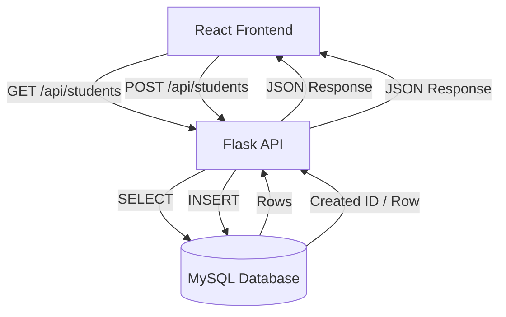

# INNOLIFT VENTURES | Crescent Internship
# DAY 44 — DATABASE INTEGRATION END-TO-END

## 1. Project Overview

This is the continuation of the Day 41, Day 42 and Day 43 Student Management project.

The main change in Day 44 is replacing temporary Python in-memory data with a real MySQL database.

The application now supports:

- React student form
- Flask GET and POST APIs
- MySQL database storage
- Persistent student records
- Loading state
- Success messages
- User-friendly API/database error messages
- Duplicate email handling
- Environment variables for database credentials

## 2. Technology Stack

- Frontend: React + Vite
- Backend: Flask
- Database: MySQL
- Database driver: mysql-connector-python
- Configuration: python-dotenv
- API communication: JSON over HTTP
- CORS: flask-cors

## 3. MySQL Database Setup

Open MySQL Workbench.

Open:

`database/student_management.sql`

Run the script.

It creates:

`student_management`

and:

`students`

with:

- id
- name
- email
- course

It also inserts 5 sample student records.

Verify directly in MySQL:

```sql
USE student_management;
SELECT * FROM students;
```

## 4. Database Structure

```text
student_management
└── students
    ├── id INT PRIMARY KEY AUTO_INCREMENT
    ├── name VARCHAR(100) NOT NULL
    ├── email VARCHAR(150) NOT NULL UNIQUE
    └── course VARCHAR(100) NOT NULL
```

The email column is UNIQUE so duplicate-email requests return a meaningful error.

## 5. Environment Configuration

Inside `backend/`, create a file named:

`.env`

Copy the values from `.env.example` and replace the password:

```env
DB_HOST=localhost
DB_PORT=3306
DB_USER=root
DB_PASSWORD=your_mysql_password
DB_NAME=student_management
```

Never commit `.env`.

The root `.gitignore` already includes:

```text
.env
```

## 6. API Endpoints

### GET /api/students

Purpose:

Retrieve all students from MySQL.

Flow:

```text
React fetch()
    ↓
GET /api/students
    ↓
Flask
    ↓
MySQL SELECT
    ↓
Flask JSON
    ↓
React Student List
```

Example success response:

```json
{
  "success": true,
  "count": 5,
  "students": [
    {
      "id": 1,
      "name": "Rahul",
      "email": "rahul@example.com",
      "course": "Python"
    }
  ]
}
```

### POST /api/students

Purpose:

Validate and insert a new student into MySQL.

Flow:

```text
React Form
    ↓
fetch()
    ↓
POST /api/students
    ↓
Flask validation
    ↓
MySQL INSERT
    ↓
Created row selected from MySQL
    ↓
JSON response
    ↓
React success message
    ↓
Student list update
```

Example request:

```json
{
  "name": "Usman",
  "email": "usman@gmail.com",
  "course": "React JS"
}
```

Example success response:

```json
{
  "success": true,
  "message": "Student added successfully.",
  "student": {
    "id": 6,
    "name": "Usman",
    "email": "usman@gmail.com",
    "course": "React JS"
  }
}
```

## 7. Frontend → Backend → MySQL Architecture



## 8. How to Run the Project

### Step 1 — MySQL

Make sure MySQL Server is running.

Create the database and table by running:

`database/student_management.sql`

### Step 2 — Backend

Open a terminal:

```bash
cd backend
python -m pip install -r requirements.txt
python app.py
```

Flask should run at:

`http://127.0.0.1:5000`

### Step 3 — Frontend

Open a second terminal:

```bash
cd frontend
npm install
npm run dev
```

Open the Vite URL, normally:

`http://localhost:5173`

## 9. Persistence Verification

1. Add a new student using the React form.
2. Confirm the success message.
3. Open MySQL.
4. Run:

```sql
USE student_management;
SELECT * FROM students;
```

5. Confirm the new student exists.
6. Refresh the React page.
7. The student should still appear because it is loaded from MySQL.

This demonstrates the difference between temporary data and persistent database data.

## 10. Error Handling

### Missing fields

The Flask API returns HTTP 400:

```json
{
  "success": false,
  "message": "Name, email and course are required."
}
```

### Duplicate email

The database UNIQUE constraint is handled by Flask and returns HTTP 409:

```json
{
  "success": false,
  "message": "Email already exists. Please use a different email."
}
```

### Database failure

Flask catches MySQL errors and returns HTTP 500:

```json
{
  "success": false,
  "message": "Unable to save student."
}
```

or:

```json
{
  "success": false,
  "message": "Unable to load students from database."
}
```

React reads the JSON response and displays the message in the UI.

## 11. Important Viva Flow

### When the application opens

```text
React
  ↓
fetch GET /api/students
  ↓
Flask
  ↓
MySQL SELECT
  ↓
Flask converts rows to JSON
  ↓
React receives JSON
  ↓
useState stores students
  ↓
Student List appears
```

### When Submit is clicked

```text
React Form
  ↓
onSubmit
  ↓
fetch POST /api/students
  ↓
Flask receives JSON
  ↓
Validate name/email/course
  ↓
MySQL INSERT
  ↓
Flask gets created row
  ↓
JSON response
  ↓
React shows success
  ↓
React adds returned student to state
  ↓
UI updates without refresh
```

## 12. Security

Never upload:

- `.env`
- MySQL password
- API keys
- Other secrets

The project uses environment variables and `.gitignore` protection.
